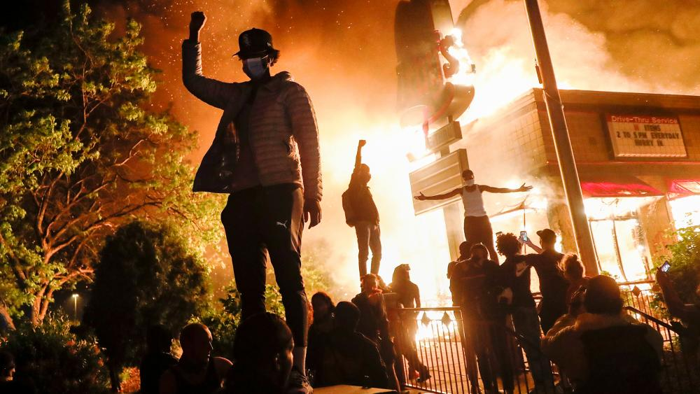

## We are in the midst of history in the making.

After the death of George Floyd, American society has said "enough is enough". The event has caused an eruption of support for the Black Lives Movement all over social media platforms. Although this is not the first time that the black lives matter movement has gained steam, this is one of the most forceful, united, and widespread response it has seen. In my opinion, what makes this movement truly powerful is the conversations that people are having. For the first time I feel like there are a multitude of posts across instagram, twitter, and facebook explaining the movement's purpose with evidence. Each of these adds to the perspective and helps to further the conversation and that is a powerful force. I'm making this post to document what I believe and hope will be a turning point in American society. 

If you would like to support the movement but don't know where to start, let me be the first to help.
[Sign petitions, donate money, go on peaceful protests, and continue the conversation.](blacklivesmatters.carrd.co/)